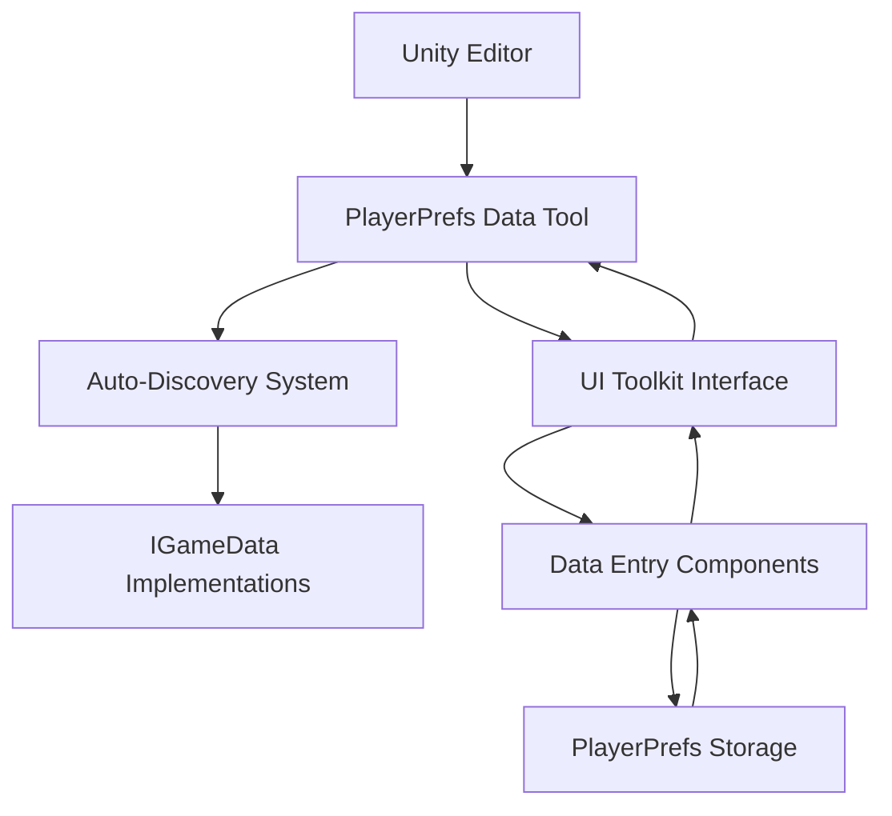

# 🎮 PlayerPrefs Data Manager

> 💡 **A powerful Unity Editor tool for managing game data stored in PlayerPrefs with a beautiful UI Toolkit interface**

---

## 📖 Overview

This tool provides **complete control over your PlayerPrefs data** with an intuitive visual interface. It automatically discovers all your `[Serializable]` classes that implement `IGameData` and lets you **edit them like Unity Inspector fields**.

### ⭐ Key Features
- 🔍 **Smart JSON Detection**: Automatically scans PlayerPrefs for existing JSON data
- ✨ **Auto-Discovery**: Finds all `IGameData` implementations and matches with saved data
- 🎨 **Beautiful UI**: Modern UI Toolkit interface with dark theme
- 📝 **Live Editing**: Edit data values like Unity Inspector fields
- 💾 **Granular Control**: Load/save individual data types or all at once
- 🔧 **Flexible Key Matching**: Finds data using multiple naming patterns
- 📄 **Enhanced JSON Handling**: Robust serialization/deserialization with error handling
- 🔒 **Safe Operations**: Validation and confirmation dialogs for all operations
- 🚀 **Cross-Platform**: Works on Windows, Mac, and Linux with platform-specific optimizations

### 🎯 Use Cases
- 📱 **Debug player progress** during development
- 🎮 **Test different game states** without playing through content
- 🌟 **Reset specific data** without losing everything
- 🔧 **Modify save data** for testing edge cases

### 📋 Prerequisites
- 🔧 Unity version: `2022.3+` (for UI Toolkit support)
- 📦 Required packages: `Newtonsoft.Json` (for serialization)
- ⚙️ Dependencies: Classes must implement [`IGameData`](./MicroData/IGameData.cs)

---

> 💡 **Quick Start**: Open the tool via `Tools → Foundations → PlayerPrefs Data Manager`

---

## 🏗️ Feature Components

> 🎨 This tool follows **modern Unity Editor patterns** with UI Toolkit

### 📂 Folder Structure

```
DataFlow/
├── 📦 MicroData/               # Core interfaces
│   └── IGameData.cs           # Base interface for game data
├── 📁 Editor/                 # Tool implementation
│   ├── PlayerPrefsDataTool.cs        # Main editor window
│   ├── PlayerPrefsDataEntry.cs       # Data entry management
│   ├── PlayerPrefsDataTool.uxml      # UI layout
│   └── PlayerPrefsDataTool.uss       # Styling
└── 📚 README.md               # This documentation
```

---

### 🔧 Core Components

#### 📦 MicroData/
> 🎯 **Core interface definitions for game data**

- 📄 **[`IGameData.cs`](./MicroData/IGameData.cs)**: Base interface that all game data must implement

#### 📁 Editor/
> 🎯 **Complete tool implementation with UI Toolkit**

- 📄 **[`PlayerPrefsDataTool.cs`](./Editor/PlayerPrefsDataTool.cs)**: Main editor window with reflection-based discovery
- 📄 **[`PlayerPrefsDataEntry.cs`](./Editor/PlayerPrefsDataEntry.cs)**: Individual data entry with UI generation
- 📄 **[`PlayerPrefsDataTool.uxml`](./Editor/PlayerPrefsDataTool.uxml)**: Modern UI layout with responsive design
- 📄 **[`PlayerPrefsDataTool.uss`](./Editor/PlayerPrefsDataTool.uss)**: Beautiful dark theme styling

---

### 📊 Architecture Flow



> 💡 **How it works**: The tool scans all assemblies for `[Serializable]` classes implementing `IGameData`, then creates dynamic UI for each one

---

## 📖 Usage Instructions

### 🚀 Quick Start

> ⏱️ **Setup time**: ~2 minutes

#### 1️⃣ Open the Tool
```
📁 Unity Menu Bar
└── Tools → Foundations → PlayerPrefs Data Manager
```

#### 2️⃣ Your Data Classes
Make sure your data classes follow this pattern:
```csharp
[Serializable]
public class PlayerProgressData : IGameData
{
    [JsonIgnore]
    public int Version => 1;
    
    public int currentLevel = 1;
    public float experiencePoints = 0f;
    public bool hasCompletedTutorial = false;
    public string playerName = "Player";
}
```

#### 3️⃣ Load and Edit
- 🔍 Tool **automatically scans PlayerPrefs** for existing JSON data on startup
- 🎮 Click **"📥 Load All Data"** to load discovered data into the UI
- ✏️ Expand any data entry to edit values in real-time
- 💾 Click **"💾 Save All Data"** or use individual save buttons
- 🔧 Tool matches JSON data with your `IGameData` types automatically

> 💡 **Smart Detection**: Tool finds data using multiple key patterns like `GameData_TypeName`, `TypeName`, `Data_TypeName`, etc.

---

### 🧪 Testing with Example Data

#### Quick Test Setup with JsonPlayerPrefsExample

> ⏱️ **Test setup time**: ~1 minute

Want to see the tool in action immediately? Use the provided example script:

**Step 1: Add Test Script**
1. 📁 Find [`TestPlayerPrefsData.cs`](./Examples/TestPlayerPrefsData.cs) in the Examples folder
2. 🎮 Add it to any GameObject in your scene  
3. ✅ Make sure example data classes are in your project (they're included!)

**Step 2: Generate Test Data**
```csharp
// In Inspector or via Context Menu
TestPlayerPrefsData → "Create Sample PlayerPrefs Data"
```

**Alternative: Check Existing Data**
```csharp
// See what's already saved
TestPlayerPrefsData → "Show Existing PlayerPrefs"
```

**Step 3: Open Tool and Load**
1. 🔧 `Tools → Foundations → PlayerPrefs Data Manager`
2. 📥 Click "Load All Data"  
3. 🎉 See your data loaded and ready to edit!

**What Gets Created:**
- 📊 `PlayerProgressData` - Player level, XP, stats
- 💰 `InventoryData` - Gold, items, equipment  
- ⚙️ `GameSettings` - Audio, graphics, controls
- 🏆 `AchievementData` - Unlocked achievements  
- 🎮 `GameConfiguration` - Difficulty, world settings

> 💡 **Pro Tip**: Use different key formats to test the tool's smart detection:
> ```csharp
> PlayerPrefs.SetString("GameData_PlayerProgressData", json);  // Standard
> PlayerPrefs.SetString("PlayerData", json);                   // Short
> PlayerPrefs.SetString("Save_PlayerProgress", json);          // Prefixed
> ```

---

### 💻 Basic Usage

#### 🎮 Working with Individual Data Entries

> 📄 **Each data type gets its own expandable section**

```csharp
// Your data class automatically appears in the tool
[Serializable]
public class InventoryData : IGameData
{
    [JsonIgnore]
    public int Version => 1;
    
    public int goldCoins = 100;
    public List<string> itemIds = new List<string>();
    public bool hasRareItem = false;
}
```

**Steps to manage this data:**
1. 📦 **Find the entry** - Look for "📦 InventoryData" in the tool
2. 🖱️ **Click to expand** - Click the header to show/hide fields
3. ✏️ **Edit values** - Modify `goldCoins`, `hasRareItem`, etc.
4. 💾 **Save changes** - Use individual "💾 Save" button or "Save All"

#### 🚀 Advanced Operations

> 📄 **Bulk operations for efficiency**

```csharp
// The tool handles multiple data types seamlessly
[Serializable] public class PlayerStats : IGameData { /* ... */ }
[Serializable] public class GameSettings : IGameData { /* ... */ }
[Serializable] public class AchievementData : IGameData { /* ... */ }

// All three appear automatically in the tool!
```

**Bulk operations:**
- 📥 **Load All** - Loads all discovered data types from PlayerPrefs
- 💾 **Save All** - Saves all modified data back to PlayerPrefs  
- 🗑️ **Clear All** - Deletes ALL PlayerPrefs data (with confirmation)

---

### 🎯 Common Use Cases

#### Use Case 1: Testing Different Player Levels
> 📄 **Quickly test high-level content without grinding**

1. 📥 Load your `PlayerProgressData`
2. ✏️ Change `currentLevel` to `50`
3. ✏️ Set `experiencePoints` to `999999`
4. 💾 Save the data
5. ▶️ Play your game - you're now level 50!

#### Use Case 2: Debugging Save System Issues
> 📄 **Inspect exact data being saved**

1. 🎮 Play your game and save normally
2. 📥 Open the tool and load all data
3. 🔍 Inspect all values to verify they're correct
4. ✏️ Manually fix any incorrect values
5. 💾 Save back to PlayerPrefs

#### Use Case 3: Resetting Specific Data
> 📄 **Clear only certain data without losing everything**

1. 📦 Find the specific data entry you want to reset
2. ✏️ Expand it and reset values to defaults
3. 💾 Save just that entry
4. 🎮 Other data remains untouched

---

### 📚 Menu Items Reference

| Menu Item | Shortcut | Description |
|----------|----------|-------------|
| `Tools → Foundations → PlayerPrefs Data Manager` | - | Opens the main tool window |
| `Tools → Foundations → Refresh PlayerPrefs Data Manager` | - | Rescans for new IGameData types and PlayerPrefs keys |
| `Tools → Foundations → Open PlayerPrefs Location` | - | Shows where PlayerPrefs are stored on your system |
| `Tools → Foundations → Debug PlayerPrefs Scanner` | - | **NEW!** Scans and logs all PlayerPrefs keys for debugging |

### 🔍 Debug Tools

#### Debug PlayerPrefs Scanner

> 🎯 **Perfect for troubleshooting** - shows exactly what's in PlayerPrefs

```
🔧 Tools → Foundations → Debug PlayerPrefs Scanner
```

**What it does:**
- 📋 Lists ALL PlayerPrefs keys found
- 📄 Shows which keys contain valid JSON
- 🎯 Attempts to match JSON data with your IGameData types
- 📊 Provides detailed Console output for diagnosis

**Sample Output:**
```
📦 Found 3 IGameData types: PlayerProgressData, InventoryData, GameSettings
🔑 Found 5 total PlayerPrefs keys  
📄 Key: 'GameData_PlayerProgressData' | JSON: True | Length: 247
✅ Successfully matched 'GameData_PlayerProgressData' → PlayerProgressData
📄 Key: 'SomeOtherKey' | JSON: False | Length: 12
```

---

## 🎮 Unity GameObject Setup

> ⚠️ **Note**: This tool is **editor-only** and doesn't require any GameObjects in your scenes

### 📦 No GameObject Setup Required!

This is a pure **Unity Editor tool** that works entirely through the Editor interface. You don't need to:
- ❌ Add any GameObjects to scenes
- ❌ Attach any components
- ❌ Configure any prefabs

### ⚙️ Data Class Requirements

Instead, just make sure your data classes follow this pattern:

```csharp
using System;
using Newtonsoft.Json;
using Foundations.DataFlow.MicroData;

[Serializable]  // ✅ Must be serializable
public class YourGameData : IGameData  // ✅ Must implement IGameData
{
    [JsonIgnore]  // ✅ Required for Version property
    public int Version => 1;
    
    // ✅ Your actual data fields
    public string playerName = "";
    public int level = 1;
    public float health = 100f;
    public bool isAlive = true;
}
```

**Requirements:**
- ✅ **Must have `[Serializable]` attribute**
- ✅ **Must implement `IGameData` interface**
- ✅ **Version property must have `[JsonIgnore]`**
- ✅ **Fields should be public for UI editing**

---

## 📚 API Reference

> 📄 **Main classes and their public APIs**

---

### 🎮 PlayerPrefsDataTool Class

> 📄 **Source**: [`Editor/PlayerPrefsDataTool.cs`](./Editor/PlayerPrefsDataTool.cs)

#### 🔧 Static Methods

##### `ShowWindow()`

> 🎯 **Purpose**: Opens the PlayerPrefs Data Manager window

**Usage:**
```csharp
// Open programmatically
PlayerPrefsDataTool.ShowWindow();
```

---

##### `RefreshTool()`

> 🎯 **Purpose**: Rescans assemblies for new IGameData implementations

**Usage:**
```csharp
// Refresh after adding new data classes
PlayerPrefsDataTool.RefreshTool();
```

---

##### `OpenPlayerPrefsLocation()`

> 🎯 **Purpose**: Shows where PlayerPrefs are stored on the current platform

**Platforms:**
- 🪟 **Windows**: Registry location
- 🍎 **Mac**: .plist file location  
- 🐧 **Linux**: Platform-specific info

---

### 🎮 PlayerPrefsDataEntry Class

> 📄 **Source**: [`Editor/PlayerPrefsDataEntry.cs`](./Editor/PlayerPrefsDataEntry.cs)

#### 📊 Public Properties

##### `DataType`

> 🎯 **Purpose**: Gets the Type of the managed data class

**Type:** `Type`

**Usage:**
```csharp
var entry = new PlayerPrefsDataEntry(typeof(PlayerData));
Debug.Log($"Managing: {entry.DataType.Name}");
```

---

##### `HasData`

> 🎯 **Purpose**: Checks if this entry currently has loaded data

**Type:** `bool`

**Usage:**
```csharp
if (entry.HasData)
{
    Debug.Log("Data is loaded and ready for editing");
}
```

---

#### 🔧 Public Methods

##### `LoadData()`

> 🎯 **Purpose**: Loads data from PlayerPrefs for this specific type

**Example:**
```csharp
// Load just this data type
entry.LoadData();

// Check if successful
if (entry.HasData)
{
    Debug.Log("✅ Data loaded successfully");
}
```

---

##### `SaveData()`

> 🎯 **Purpose**: Saves current data to PlayerPrefs for this specific type

**Example:**
```csharp
// Save just this data type
entry.SaveData();
```

---

##### `DeleteData()`

> 🎯 **Purpose**: Deletes this data type from PlayerPrefs

**Example:**
```csharp
// Remove this specific data type
entry.DeleteData();
```

---

### 🔔 Events

#### `OnDataChanged`

> 🎯 **Purpose**: Fired when user modifies data in the UI

**Event Type:** `Action<PlayerPrefsDataEntry>`

**Usage:**
```csharp
entry.OnDataChanged += (modifiedEntry) =>
{
    Debug.Log($"User modified {modifiedEntry.TypeName}");
};
```

---

## ⚙️ Configuration Options

### 🎨 Supported Data Types

The tool automatically creates appropriate UI fields for these data types:

| C# Type | UI Element | Example Value |
|---------|------------|---------------|
| `int` | Integer Field | `42` |
| `float` | Float Field | `3.14f` |
| `string` | Text Field | `"Hello World"` |
| `bool` | Toggle | `true/false` |
| `Vector2` | Vector2 Field | `(1, 2)` |
| `Vector3` | Vector3 Field | `(1, 2, 3)` |
| `Color` | Color Picker | `Red, Blue, etc.` |
| `Enum` | Enum Dropdown | `YourEnumValue` |

---

### 🔧 Serialization Settings

#### JSON Serialization Configuration

The tool uses **Newtonsoft.Json** for serialization with these settings:

```csharp
// Automatic formatting for readable PlayerPrefs
var jsonData = JsonConvert.SerializeObject(data, Formatting.Indented);

// Respects [JsonIgnore] attributes
[JsonIgnore]
public int Version => 1;  // This won't be saved to PlayerPrefs
```

**Benefits:**
- ✅ **Human-readable** JSON in PlayerPrefs
- ✅ **Proper handling** of Unity types (Vector3, Color, etc.)
- ✅ **Attribute support** ([JsonIgnore], [JsonProperty])

---

### 📁 Data Storage Pattern

#### PlayerPrefs Key Detection

The tool intelligently scans for JSON data using **multiple key patterns**:

**Primary Pattern:**
```
GameData_{TypeName}
```

**Alternative Patterns Detected:**
- `TypeName` (e.g., `PlayerProgressData`)
- `Data_TypeName` (e.g., `Data_PlayerProgressData`)
- `Save_TypeName` (e.g., `Save_PlayerProgressData`)
- `Player_TypeName` (e.g., `Player_PlayerProgressData`)
- `TypeNameData` (e.g., `PlayerProgressData`)
- `TypeNameConfig` (e.g., `PlayerProgressConfig`)

**Smart Matching:**
- ✅ **JSON Validation**: Only processes keys containing valid JSON
- ✅ **Type Compatibility**: Attempts deserialization to ensure data matches
- ✅ **Fallback Scanning**: Scans all PlayerPrefs keys as last resort
- ✅ **Cross-Platform**: Works on Windows (Registry), Mac (plist), Linux

**Examples:**
```csharp
// All these keys would be detected for PlayerProgressData:
PlayerPrefs.SetString("GameData_PlayerProgressData", json);  // ✅ Primary
PlayerPrefs.SetString("PlayerProgressData", json);           // ✅ Direct
PlayerPrefs.SetString("Data_PlayerProgressData", json);      // ✅ Prefixed
PlayerPrefs.SetString("PlayerProgress", json);               // ✅ Shortened
```

This flexible approach works with **any existing save system** without requiring code changes!

---

### 🎨 UI Customization

#### CSS Classes for Styling

You can modify [`PlayerPrefsDataTool.uss`](./Editor/PlayerPrefsDataTool.uss) to customize the appearance:

```css
/* Main button styling */
.primary-button {
    background-color: rgb(88, 166, 255);  /* Blue theme */
    border-radius: 6px;
    padding: 8px 16px;
}

/* Data entry styling */
.data-entry {
    background-color: rgb(64, 64, 64);    /* Dark theme */
    border-radius: 6px;
    margin-bottom: 8px;
}
```

**Key classes you can modify:**
- `.primary-button`, `.success-button`, `.danger-button` - Button colors
- `.data-entry`, `.data-entry-header` - Data entry appearance
- `.property-field`, `.property-value` - Field styling

---

## 🔧 Troubleshooting

### 🐛 Common Issues

#### ❌ Issue #1: "Tool not showing saved data"

> 🔍 **Symptoms**: Tool opens but doesn't show existing PlayerPrefs data

**✅ Solutions:**

##### Step 1: Use Debug Scanner
```
🔧 Tools → Foundations → Debug PlayerPrefs Scanner
```
This will scan and log ALL PlayerPrefs keys and show which ones contain JSON data.

##### Step 2: Check Console Output
Look for these debug messages:
- `🔍 Found X total PlayerPrefs keys`
- `📄 Found JSON key: 'YourKey' (1234 chars)`
- `✅ Successfully matched 'YourKey' → YourType`

##### Step 3: Verify Data Format
Your PlayerPrefs JSON should look like this:
```json
{
  "playerName": "TestPlayer",
  "currentLevel": 15,
  "experiencePoints": 2500.0
}
```

##### Step 4: Try Manual Load
1. 📥 Click **"Load All Data"** button
2. 🔄 If still nothing, click **"Refresh PlayerPrefs Data Manager"**
3. 📋 Expand individual data entries to see if they loaded

---

#### ❌ Issue #2: "No data types found"

> 🔍 **Symptoms**: Tool shows "📁 No Data Found" message

**✅ Solutions:**

##### Step 1: Check Your Data Classes
```csharp
// ❌ Missing requirements
public class PlayerData : IGameData  // Missing [Serializable]!
{
    public int Version => 1;  // Missing [JsonIgnore]!
    public int level = 1;
}

// ✅ Correct implementation
[Serializable]  // Must have this!
public class PlayerData : IGameData
{
    [JsonIgnore]  // Must have this!
    public int Version => 1;
    
    public int level = 1;
}
```

##### Step 2: Verify Assembly Loading
- 🔍 Check Console for "ReflectionTypeLoadException" errors
- 🔄 Try `Tools → Foundations → Refresh PlayerPrefs Data Manager`
- 🛠️ Rebuild your project (`Build → Clean Solution`)

---

#### ❌ Issue #2: "Data not saving properly"

> 🔍 **Symptoms**: Changes made in tool don't persist in game

**✅ Solutions:**

##### Step 1: Check PlayerPrefs Keys
```csharp
// Verify your game loads data the same way
var key = "GameData_PlayerProgressData";  // Same format as tool
var jsonData = PlayerPrefs.GetString(key);
var data = JsonConvert.DeserializeObject<PlayerProgressData>(jsonData);
```

##### Step 2: Verify Serialization Compatibility  
- ✅ Use **Newtonsoft.Json** in your game code too
- ✅ Keep same field names and types
- ✅ Test with simple data first

---

#### ❌ Issue #3: "UI fields not updating"

> 🔍 **Symptoms**: Changing values in tool doesn't reflect in UI

**✅ Solutions:**

##### Step 1: Check Data Binding
- 📥 Try **"Load All Data"** to refresh UI
- 🔄 Close and reopen the tool window
- 🎯 Make sure you're editing the expanded data entry

##### Step 2: Verify Field Types
```csharp
// ✅ Supported types
public int intValue = 0;        // Creates IntegerField
public string textValue = "";   // Creates TextField  
public bool boolValue = false;  // Creates Toggle

// ❌ Unsupported types (fallback to TextField)
public Dictionary<string, int> complexType;  // Not directly supported
public CustomClass customObject;             // Not directly supported
```

---

#### ❌ Issue #4: "Tool window is blank"

> 🔍 **Error**: Window opens but shows no content

**✅ Solutions:**

##### Step 1: Check UXML File Location
```
📁 Project Structure
└── Assets/Foundations/DataFlow/Editor/
    ├── PlayerPrefsDataTool.uxml     ✅ Must be here
    ├── PlayerPrefsDataTool.uss      ✅ Must be here  
    └── PlayerPrefsDataTool.cs       ✅ Must be here
```

##### Step 2: Verify Package Dependencies
- 📦 Check **Package Manager** → `Newtonsoft.Json` installed
- 🔧 Unity version `2022.3+` for full UI Toolkit support

---

### 🔍 Debug Tips

#### Enable Detailed Logging
The tool automatically logs detailed information to Console:
```
✅ PlayerPrefs Data Manager initialized successfully
🔍 Found 3 data types: PlayerData, InventoryData, SettingsData
✅ Load All Data completed: 2 loaded, 0 errors
```

#### Check PlayerPrefs Manually
```csharp
// Verify data exists in PlayerPrefs
var key = "GameData_YourDataType";
if (PlayerPrefs.HasKey(key))
{
    var json = PlayerPrefs.GetString(key);
    Debug.Log($"Stored JSON: {json}");
}
```

#### Use Menu Helpers
- 🔄 **Refresh Tool**: `Tools → Foundations → Refresh PlayerPrefs Data Manager`
- 📂 **Check Location**: `Tools → Foundations → Open PlayerPrefs Location`

---

### 📖 Error Messages Reference

| Error Message | Cause | Solution |
|---------------|-------|----------|
| `Could not load PlayerPrefsDataTool.uxml` | UXML file missing | Check file location and reimport |
| `ReflectionTypeLoadException` | Assembly loading issue | Rebuild project, check dependencies |
| `JsonSerializationException` | Data format error | Clear PlayerPrefs and start fresh |
| `No data types found` | No IGameData implementations | Add [Serializable] and implement IGameData |

---

### 💬 Get Help

#### 🆘 Still having issues?

- 📖 **Check Console**: Look for detailed error messages with JSON scanning info
- 🔄 **Try refresh**: Use refresh menu item to rescan PlayerPrefs keys
- 🧹 **Clean slate**: Delete all PlayerPrefs and start fresh
- 🧪 **Test with examples**: Use [`JsonPlayerPrefsExample.cs`](./Examples/JsonPlayerPrefsExample.cs) to generate test data
- 📧 **Report bugs**: Include Unity version, error messages, and steps to reproduce

#### 📝 When reporting issues, include:
- ✅ Unity version (e.g., `2022.3.12f1`)
- ✅ Tool version and file locations
- ✅ Your data class code
- ✅ Console error messages
- ✅ Screenshots of the issue

> 🔗 **More help**: Check Unity Console for detailed error messages and stack traces

---

## 🎉 Summary

### ✅ What You Get:
1. 🎮 **Beautiful tool** for managing PlayerPrefs data
2. 🔍 **Smart detection** - finds existing JSON data automatically
3. ✏️ **Live editing** with Inspector-like interface
4. 💾 **Granular control** - save individual or all data types
5. 🛡️ **Safe operations** with validation and confirmation dialogs
6. 🎨 **Modern UI** built with Unity's UI Toolkit
7. 🔧 **Debug tools** - comprehensive troubleshooting utilities
8. 🧪 **Test helpers** - ready-to-use example scripts for testing

### 🎯 Perfect For:
- 👨‍💻 **Developers** testing different game states
- 🎮 **Game designers** balancing progression systems  
- 🐛 **QA testers** reproducing specific scenarios
- 📱 **Anyone** who needs to manage game save data

### 💡 Key Benefits:
- ⚡ **No setup required** - just implement IGameData
- 🔄 **Works with existing code** - no changes needed
- 🎨 **Beautiful interface** - modern and intuitive
- 🚀 **Blazingly fast** - efficient reflection and UI updates

---

> 🎊 **Enjoy managing your game data with ease!** This tool will save you hours of debugging and testing time.

> 📧 **Questions or suggestions?** Feel free to reach out or contribute improvements!

---

**Made with ❤️ for the Unity community**
